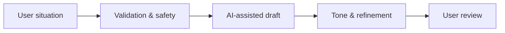

<div align="center">
  <h1>NoDrama</h1>
  <p><strong>AI-assisted drafting for clearer everyday communication, with the user staying in control of the final message.</strong></p>
  <p>
    
    
    
    
  </p>
</div>

> **Portfolio status:** Pre-production product implementation. Generated text is drafting assistance and remains subject to user review.

NoDrama helps turn awkward situations into clearer drafts for replies, apologies, refusals and rescheduling without pretending that an AI draft should be sent blindly.



## Current architecture

The repository contains a Next.js/TypeScript application with product foundations around:

- generator and reply-intelligence flows;
- Supabase-backed identity/data foundations;
- usage and credit accounting;
- Stripe checkout, webhook verification, fulfillment, and entitlement logic;
- rate limiting and operational controls;
- deterministic verification and runtime smoke tooling;
- deployment/operations documentation.

See [Architecture](docs/ARCHITECTURE.md) for the product boundary and [Monetization Layer](docs/MONETIZATION_LAYER.md) for the pricing/validation model. Some historical planning documents may predate the current implementation and must not be treated as live-state evidence without code verification.

## Safety boundary

NoDrama is intended to avoid facilitating fraud, impersonation, forged official claims or documents, malicious manipulation, and other unlawful or harmful conduct. Safety-sensitive behavior must fail closed rather than report fake success.

## Local development

```bash
npm install
npm run dev
```

Open `http://localhost:3000`.

## Verification

The repository includes deterministic verification tooling. Use the package scripts defined by the current `package.json` as the authoritative command surface.

The `/api/generate` runtime smoke matrix can be executed against a running local or production server. Reports may be written to `data/runtime/smoke-results/latest.json`; they record metadata and pass/fail evidence rather than full generated outputs.

## Commercial and legal status

NoDrama is a **commercial proprietary product**. Original NoDrama source code and product-specific materials are **All Rights Reserved** unless a specific file explicitly states otherwise.

- Source-code license: [Proprietary / All Rights Reserved](LICENSE.md)
- SaaS terms baseline: [Terms of Service](TERMS_OF_SERVICE.md)
- Privacy baseline: [Privacy Policy](PRIVACY.md)
- Third-party software/services: [Third-Party Notices](THIRD_PARTY_NOTICES.md)
- Brand, logos, and visual identity: [Trademark and Brand Policy](TRADEMARKS.md)

Third-party dependencies, APIs, models, fonts, media, and other externally owned materials retain their own rights and licenses. The proprietary NoDrama license does not relicense them.

`TERMS_OF_SERVICE.md` and `PRIVACY.md` contain explicit launch gates for operator identity, legal contact, governing law/consumer terms, retention, subprocessors, and data-subject request handling. Those fields must be completed and legally reviewed before public commercial launch.

## Release discipline

Before a commercial production launch:

1. verify the exact production dependency graph and package lock;
2. generate an SBOM/dependency inventory and collect required notices;
3. verify production provider terms and privacy settings;
4. run secret scanning against the repository and history without exposing secret values;
5. verify Stripe/webhook/entitlement behavior server-side;
6. complete privacy, consumer, refund, and operator-identity launch gates;
7. run deterministic verification and the relevant production smoke tests.

Do not treat repository visibility, a green build, or a successful client-side checkout screen as proof that the commercial release gates are complete.
